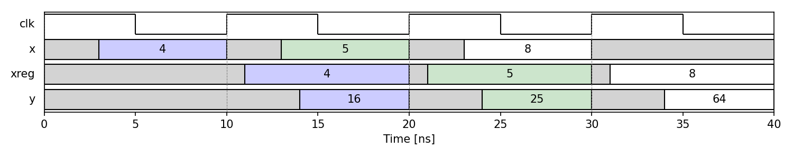

# Basic Timing Diagrams

In most cases, we will build timing diagrams from traces from a C or RTL simulation.  However, the PySilicon package also provides methods for constructing timing manually from any python data arrays.  This manual creation is used in the teaching material and can also be used for illustrations in scientific articles.

The basic module is `pysilicon.utils.timing` with three classes for building and visualising timing diagrams in matplotlib:

- `SigTimingInfo`: Holds a named sequence of (time, value) transitions for any signal 
-  `ClkSig`:  A particular instance of `SigTimingInfo` for aclock signal with a given period and number of cycles
- `TimingDiagram` :  Collects signals and renders them as a waveform diagram

## Example

To illustrate, consider visualize the waveforms for a simple registered pipeline stage with four signals:


- `clk`:  A 10 ns clock, 4 cycles
- `x`:   input data, sampled just before each rising edge
- `xreg`: registered copy of x (available 1 ns after the clock edge)
- `y`: combinational output  y = xreg * xreg (available 3 ns after `xreg` is stable)


These waveforms can be visualzied with the code:

```python
from pysilicon.utils.timing import ClkSig, SigTimingInfo, TimingDiagram

# Clock: 10 ns period, 4 cycles
clk = ClkSig(clk_name="clk", period=10, ncycles=4)

# Input x
xsig = SigTimingInfo("x",    [0, 3,  10, 13, 20, 23, 30],
                              ['x','4','x','5','x','8','x'])

# Registered value
xregsig = SigTimingInfo("xreg", [0, 11, 20, 21, 30, 31, 40],
                                 ['x','4','x','5','x','8','x'])

# Combinational output y = xreg * xreg
ysig = SigTimingInfo("y",    [0, 14, 20, 24, 30, 34, 40],
                              ['x','16','x','25','x','64','x'])

# Build and plot the timing diagram
td = TimingDiagram()
td.add_signal(clk)
td.add_signals([xsig, xregsig, ysig])

ax = td.plot_signals(trange=[0, 40])
ax.set_xlabel("Time [ns]")

# Highlight pipeline cycles with colour patches
for i, color in enumerate(['blue', 'green']):
    for s in ['x', 'xreg', 'y']:
        td.add_patch(s, ind=i * 2 + 1, color=color, alpha=0.2)
```

Running this code will generate a timing diagram as follows:



## Regenerating the figure

The PNG above is produced by the canonical example script.  Run the following
command from the repository root to regenerate it:

```bash
python examples/timing/basic_timing_diagram.py
```

The script accepts an optional `--output` argument to write the figure(s) to a
different directory.

## Full runnable example

See
[`examples/timing/basic_timing_diagram.py`](https://github.com/sdrangan/pysilicon/blob/main/examples/timing/basic_timing_diagram.py)
for the complete, annotated source.

The companion Jupyter notebook
[`examples/timing/timing_ex.ipynb`](https://github.com/sdrangan/pysilicon/blob/main/examples/timing/timing_ex.ipynb)
provides an interactive walkthrough of the same material.
